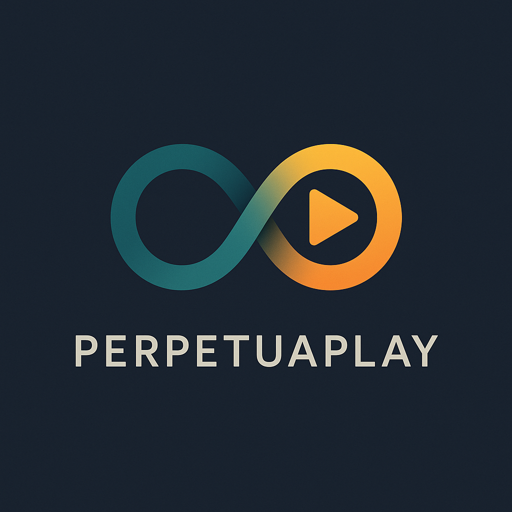

# Discord 24/7 Music Bot

<div align="center">
  
</div>

A resource-efficient Discord bot that plays a looping playlist 24/7 in a voice channel. Built with Node.js, discord.js, and @distube/ytdl-core, optimized for Azure VM deployment.

---

## Features

- Plays a user-defined playlist of YouTube URLs in a Discord voice channel
- 24/7 looping playback with robust error handling
- **Azure VM optimized** - handles cloud infrastructure challenges
- **Bot detection avoidance** - uses @distube/ytdl-core with optimized headers
- **Automatic reconnection** - recovers from network issues
- Simple commands: `!play`, `!stop`, `!skip`, `!nowplaying`, `!join`, `!leave`
- **Comprehensive logging** - detailed logs for troubleshooting
- **Memory efficient** - suitable for small VMs with PM2 management

---

## Setup & Running Instructions

### 1. Clone the Repository

```bash
git clone <your-repo-url>
cd "Discord Music bot"
```

### 2. Install Dependencies

```bash
npm install
```

### 3. Configure the Bot

#### Set your Discord Bot Token

Create a `.env` file in the project root:

```env
DISCORD_TOKEN=your_bot_token_here
```

#### Configure Your Playlist

Edit `config/playlist.json` with your YouTube URLs:

```json
[
  "https://www.youtube.com/watch?v=dQw4w9WgXcQ",
  "https://www.youtube.com/watch?v=3JZ_D3ELwOQ"
]
```

### 4. Validate Configuration (Recommended)

```bash
# Test bot token
npm run test:token

# Validate all playlist URLs
npm run test:playlist

# Complete configuration check
npm run config:validate
```

### 5. Start the Bot

#### Quick Start

```bash
./start.sh
```

#### Manual Start

```bash
npm start
```

#### Production (24/7 with PM2)

```bash
npm run pm2:start
```

### 6. Available Commands

- `!play` — Join your voice channel and start looping the playlist
- `!stop` — Stop playback and leave the channel
- `!skip` — Skip to the next song
- `!nowplaying` or `!np` — Show the current song with details
- `!join` — Join your voice channel
- `!leave` — Leave the voice channel
- `!help` — Show available commands

### 7. Troubleshooting Azure VM Issues

If you encounter "Sign in to confirm you're not a bot" errors on Azure VMs:

```bash
# Run Azure optimization script for troubleshooting tips
node scripts/azure-optimization.js

# Check cookie setup instructions
node scripts/setup-cookies.js
```

**Common Azure VM Solutions:**

- ✅ Uses @distube/ytdl-core instead of play-dl (better bot detection avoidance)
- ✅ Optimized User-Agent headers for cloud environments
- ✅ Enhanced buffer sizes for Azure network performance
- ✅ Cookie authentication setup available (see scripts/setup-cookies.js)
- ✅ Proxy configuration support for IP reputation issues

**Alternative Solutions if Issues Persist:**

1. Set up YouTube cookies (instructions in scripts/setup-cookies.js)
2. Use residential proxy services
3. Consider different Azure regions
4. Monitor IP reputation status

---

## Troubleshooting

### YouTube "Sign in to confirm you're not a bot" Error

This is common on Azure VMs due to IP reputation issues. The bot now uses @distube/ytdl-core which handles this better, but if you still encounter issues:

1. **Run the optimization script:**

   ```bash
   node scripts/azure-optimization.js
   ```

2. **Set up YouTube cookies (if needed):**

   ```bash
   node scripts/setup-cookies.js
   # Follow the instructions to extract cookies from your browser
   ```

3. **Consider using a proxy service** for residential IP addresses

4. **Check Azure region** - some regions may have better IP reputation

### Common Issues

- **Bot doesn't respond**: Check Discord token and bot permissions
- **Can't join voice channel**: Ensure bot has "Connect" and "Speak" permissions
- **Memory issues**: PM2 will restart automatically at 200MB usage
- **Network timeouts**: Azure optimization script includes network settings

### Getting Help

- Check `docs/memory_bank.md` for detailed solutions
- Run validation scripts: `npm run config:validate`
- Monitor logs: `npm run pm2:logs`

---

## License

MIT
